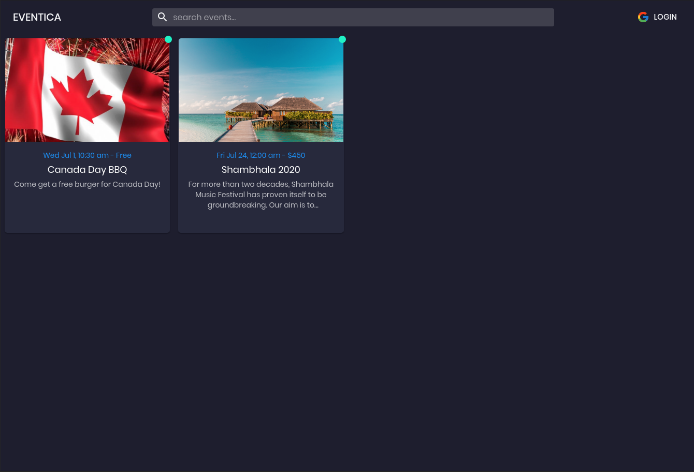

# Eventica

  

Course: SENG 513

Project: Eventica

Group Members: Albert, Satyaki, James, Brian, Sadat, Andy

Date: Winter 2020

The deployed applcation can be viewed here: [https://seng-513.web.app/](https://seng-513.web.app/)

## About

Eventica is an event management and ticketing platform built with a focus on creating an application that is easy to use, having an intuitive user interface, and having infrastructure that can support many users.

## Technologies Used

The application was built with the following technologies [React](https://reactjs.org/), [Material-UI](https://material-ui.com/), [Redux](https://redux.js.org/), [Express](https://expressjs.com/), and [node.js](https://nodejs.org/en/).

## To Run

The instructions to run the FrontEnd and BackEnd are in the corresponding folder's ReadMe.

